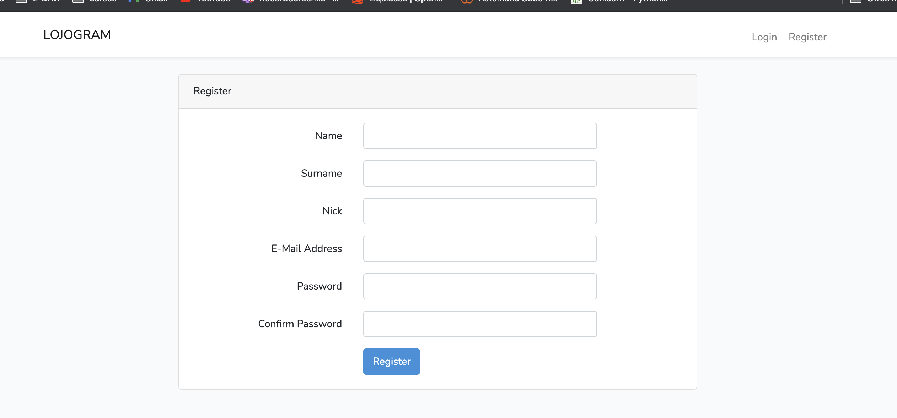
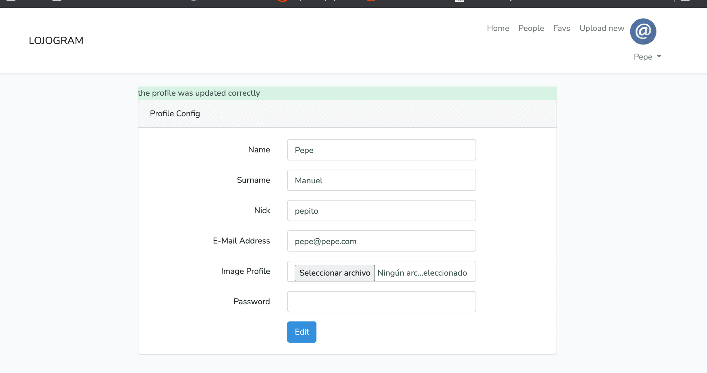
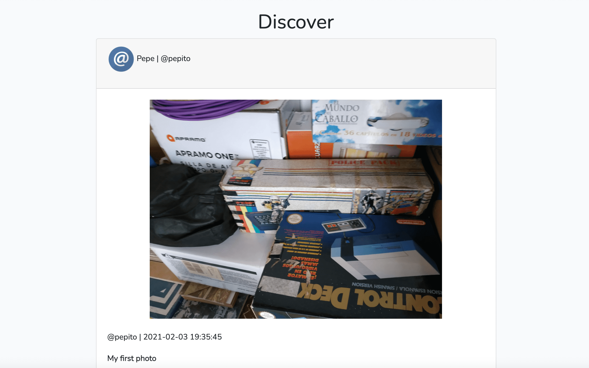
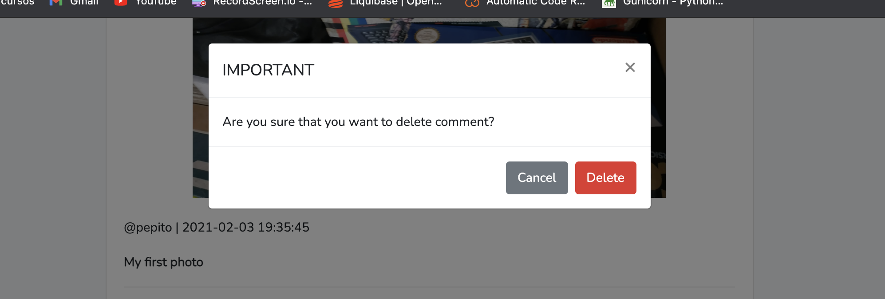
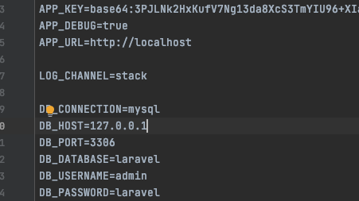
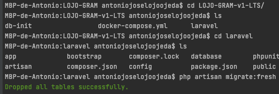
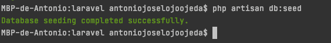

# LOJO-GRAM
Social Network app in lravel using MVC arquitecture

## Functions
An application that works in a similar way to instagram.
### You can
  * gister and log in</li>
  * Update your profile picture or personal data</li>
  * Upload delete and edit photos</li>
  * Comments and likes on another users photos</li>
  * Comments and likes on your own photos photos</li>
  * Profile home favs and config views</li>
  
### A powerful application
_Here you can see images of the application_






## RUN

_Go to LTS version_

```
_Go to LTS version_
docker-compose up
```

_at http://localhost:8080_  

```
CREATE DATABASE LARAVEL;
```


* change the DB_HOST constant in .env to 127.0.0.1 to migrate and seed
* or run these from the container



* then leave the constant with the value db (name of the container with the database)

```
php artisan migrate:fresh
```



```
php artisan db:seed
```




# Go to http://localhost:80/ and Enjoy it!
