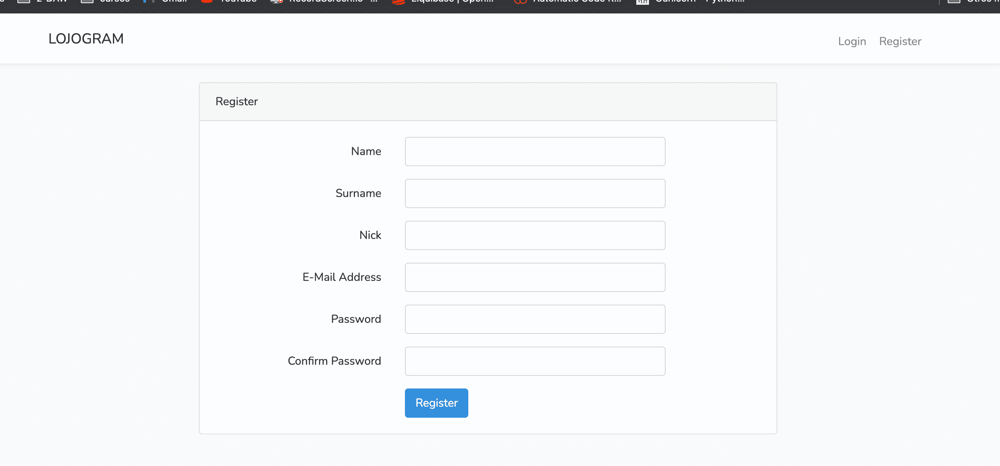
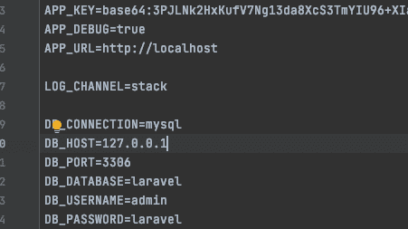

# LOJO-GRAM
Social Network app in lravel

# Functions

An application that works in a similar way to instagram.
<h2>You can</h2>
<ul>
  <li>Register and log in</li>
  <li>Update your profile picture or personal data</li>
  <li>Upload delete and edit photos</li>
  <li>Comments and likes on another users photos</li>
  <li>Comments and likes on your own photos photos</li>
  <li>Profile home favs and config views</li>
</ul>
<h2>A powerful application</h2>

Here you can see images of the application

 
 
<h2>RUN</h2>

Go to LTS version

docker-compose up
at http://localhost:8080/ CREATE DATABASE LARAVEL;

<i>change the DB_HOST constant in .env to 127.0.0.1 to migrate and seed</i>
<i>or run these from the container</i>

<i>then leave the constant with the value db (name of the container with the database)</i>

php artisan migrate:fresh

php artisan db:seed

<h2>Go to http:://localhost:80/ and Enjoy it!</h2>
